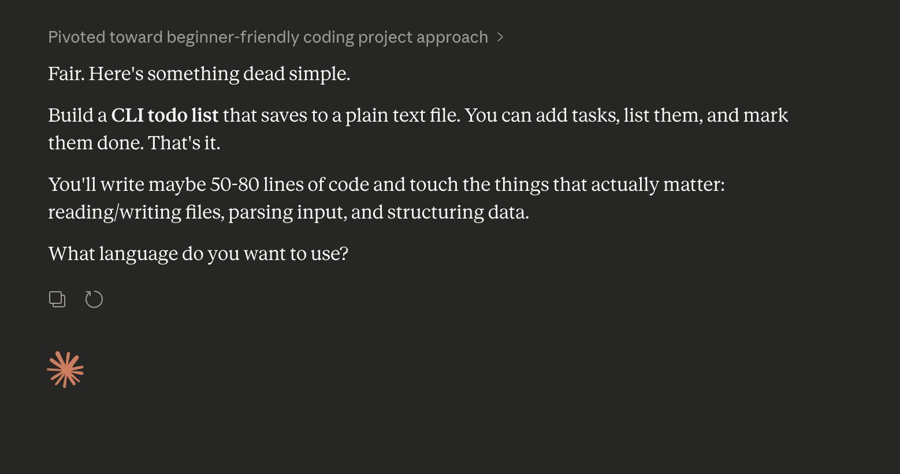

# Todo cli
A overcomplicated todo list cli made because my coding skills were rusting because of ai, made with minimal support from ai (only 3 claude debug chats and no google ai overview). The reason why its so complicated is because i decided to make it interactable with the arrow keys.

## Tiny problems
Dont try to have 0 tasks and try to add another one 

## ai usage
idea V

only 3 debug chats
1. https://claude.ai/share/80ad0d8b-51b6-4b28-98d6-b069bdf3e5ca
2. https://claude.ai/share/79300e82-acdb-4b61-958b-b16c9216a57a
3. https://claude.ai/share/1b1959dc-fc07-443b-b904-d5026a8f05aa